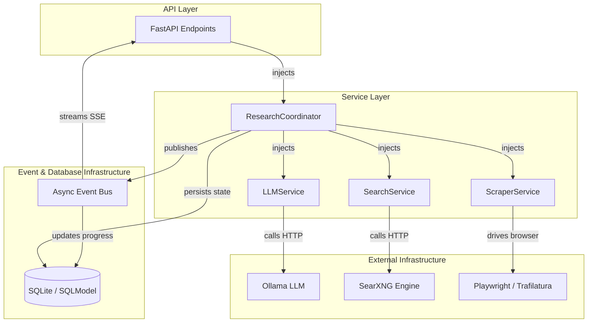
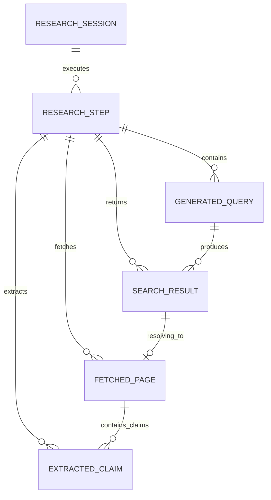
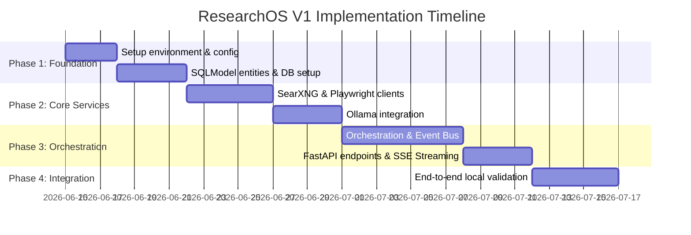

# ResearchOS - Initial Architecture Specification

ResearchOS is an open-source, local-first research operating system designed to expose every step of the research pipeline for transparency, auditability, and future learning.

This document outlines the architecture, folder structure, database schema, services, API endpoints, event models, dependencies, and development roadmap for the **V1 Scope** (Question → Query Gen → Search → Page Fetch → Claim Extraction).

---

## 1. Folder Structure

We propose a **Clean Architecture / Service-Oriented** structure. This layout decouples business logic from external frameworks (FastAPI, SQLite, Ollama, SearXNG, Playwright) and ensures easy extension for V2 (contradiction detection, evidence graphs, etc.).

```
research_os/
├── config.py                 # Pydantic-settings config (Ollama API, SearXNG, DB path)
├── db.py                     # SQLModel engine, session, and DB initialization
├── main.py                   # FastAPI app setup, startup/shutdown lifecycles
├── api/                      # Routing and Request/Response delivery
│   ├── __init__.py
│   ├── deps.py               # Dependency Injection providers (DB sessions, services)
│   └── v1/
│       ├── __init__.py
│       ├── router.py         # Registers sub-routers
│       └── endpoints/
│           ├── sessions.py   # Create/retrieve research sessions
│           └── steps.py      # Detailed audit endpoints for individual steps
├── models/                   # SQLModel entities, schemas, and enums
│   ├── __init__.py
│   ├── base.py               # Common model definitions (timestamps, primary keys)
│   ├── session.py            # ResearchSession database model & DTOs
│   ├── step.py               # ResearchStep database model & DTOs
│   ├── query.py              # GeneratedQuery database model & DTOs
│   ├── search.py             # SearchResult database model & DTOs
│   ├── page.py               # FetchedPage database model & DTOs
│   ├── claim.py              # ExtractedClaim database model & DTOs
│   └── events.py             # Event schemas for pub-sub and SSE streaming
├── services/                 # Domain / Business logic layers
│   ├── __init__.py
│   ├── base.py               # Base class for DI-friendly services
│   ├── llm.py                # Ollama integration (Query generation & Claim extraction)
│   ├── search.py             # SearXNG client wrapper
│   ├── scraper.py            # Playwright browser fetcher & Trafilatura text extraction
│   └── coordinator.py        # Orchestrates the async pipeline and publishes events
└── events/                   # Pub-Sub Infrastructure
    ├── __init__.py
    ├── bus.py                # Async in-memory Event Bus
    └── handlers.py           # Database logger & event dispatch handlers
```

---

## 2. Service Layer Architecture

Services are async-first, state-free, and receive their dependencies (like DB sessions or client pools) via Constructor Injection.



### Core Service Contracts

#### `LLMService` (Ollama)
Responsible for prompt generation and processing using local models (e.g., `llama3` or `mistral`).
* `async generate_queries(session_id: UUID, question: str, num_queries: int) -> list[str]`
* `async extract_claims(session_id: UUID, content: str, source_url: str) -> list[dict]`

#### `SearchService` (SearXNG)
Queries local SearXNG instance and extracts structured results.
* `async search(query: str, limit: int) -> list[dict]`

#### `ScraperService` (Playwright & Trafilatura)
Uses Playwright to fetch dynamic HTML, and Trafilatura to cleanly extract raw text and metadata.
* `async fetch_and_extract(url: str) -> dict` (returns text, metadata, page title, status)

#### `ResearchCoordinator` (Orchestrator)
The central manager driving the sequential pipeline in an async background task.
* `async run_session(session_id: UUID) -> None`
* Steps executed:
  1. Generate queries using `LLMService`.
  2. For each query, execute search using `SearchService`. Deduplicate by URL.
  3. For each unique URL, fetch and extract content via `ScraperService`.
  4. For each fetched page, extract claims using `LLMService`.
  5. Mark session as complete or failed.

---

## 3. Database Schema

For SQLite, we design a relational schema capturing parent-child relationships representing the step lineage.



### Traceability Links
* Every entity stores the `step_id` that generated it. This allows the system to trace a claim back to the exact search result, page text, generated query, and LLM prompt that produced it.

---

## 4. SQLModel Entities

Below are the entity definitions using **SQLModel**.

```python
from datetime import datetime
from uuid import UUID, uuid4
from typing import List, Optional, Dict, Any
from sqlmodel import SQLModel, Field, Relationship, JSON
from enum import Enum

# --- Enums ---

class SessionStatus(str, Enum):
    PENDING = "pending"
    RUNNING = "running"
    COMPLETED = "completed"
    FAILED = "failed"

class StepType(str, Enum):
    QUERY_GENERATION = "query_generation"
    SEARCH_EXECUTION = "search_execution"
    PAGE_FETCH = "page_fetch"
    CLAIM_EXTRACTION = "claim_extraction"

class StepStatus(str, Enum):
    PENDING = "pending"
    RUNNING = "running"
    COMPLETED = "completed"
    FAILED = "failed"

# --- Models ---

class ResearchSession(SQLModel, table=True):
    __tablename__ = "research_sessions"

    id: UUID = Field(default_factory=uuid4, primary_key=True)
    question: str
    status: SessionStatus = Field(default=SessionStatus.PENDING)
    created_at: datetime = Field(default_factory=datetime.utcnow)
    updated_at: datetime = Field(default_factory=datetime.utcnow)

    # Relationships
    steps: List["ResearchStep"] = Relationship(back_populates="session", cascade_delete=True)


class ResearchStep(SQLModel, table=True):
    __tablename__ = "research_steps"

    id: UUID = Field(default_factory=uuid4, primary_key=True)
    session_id: UUID = Field(foreign_key="research_sessions.id", index=True)
    step_type: StepType
    status: StepStatus = Field(default=StepStatus.PENDING)
    
    # Store dynamic execution context / audit trail
    input_payload: Dict[str, Any] = Field(default_factory=dict, sa_column=Field(sa_type=JSON))
    output_payload: Dict[str, Any] = Field(default_factory=dict, sa_column=Field(sa_type=JSON))
    error_message: Optional[str] = Field(default=None)

    started_at: Optional[datetime] = Field(default=None)
    completed_at: Optional[datetime] = Field(default=None)

    # Relationships
    session: ResearchSession = Relationship(back_populates="steps")
    queries: List["GeneratedQuery"] = Relationship(back_populates="step", cascade_delete=True)
    search_results: List["SearchResult"] = Relationship(back_populates="step", cascade_delete=True)
    fetched_pages: List["FetchedPage"] = Relationship(back_populates="step", cascade_delete=True)
    extracted_claims: List["ExtractedClaim"] = Relationship(back_populates="step", cascade_delete=True)


class GeneratedQuery(SQLModel, table=True):
    __tablename__ = "generated_queries"

    id: UUID = Field(default_factory=uuid4, primary_key=True)
    step_id: UUID = Field(foreign_key="research_steps.id", index=True)
    query_text: str
    created_at: datetime = Field(default_factory=datetime.utcnow)

    # Relationships
    step: ResearchStep = Relationship(back_populates="queries")
    search_results: List["SearchResult"] = Relationship(back_populates="query")


class SearchResult(SQLModel, table=True):
    __tablename__ = "search_results"

    id: UUID = Field(default_factory=uuid4, primary_key=True)
    step_id: UUID = Field(foreign_key="research_steps.id", index=True)
    query_id: UUID = Field(foreign_key="generated_queries.id", index=True)
    title: str
    url: str
    snippet: str
    score: float
    engine: str
    created_at: datetime = Field(default_factory=datetime.utcnow)

    # Relationships
    step: ResearchStep = Relationship(back_populates="search_results")
    query: GeneratedQuery = Relationship(back_populates="search_results")
    fetched_page: Optional["FetchedPage"] = Relationship(back_populates="search_result")


class FetchedPage(SQLModel, table=True):
    __tablename__ = "fetched_pages"

    id: UUID = Field(default_factory=uuid4, primary_key=True)
    step_id: UUID = Field(foreign_key="research_steps.id", index=True)
    search_result_id: UUID = Field(foreign_key="search_results.id", index=True)
    url: str
    title: Optional[str] = Field(default=None)
    extracted_text: str
    extracted_metadata: Dict[str, Any] = Field(default_factory=dict, sa_column=Field(sa_type=JSON))
    fetch_status: str  # "success", "error", "timeout"
    created_at: datetime = Field(default_factory=datetime.utcnow)

    # Relationships
    step: ResearchStep = Relationship(back_populates="fetched_pages")
    search_result: SearchResult = Relationship(back_populates="fetched_page")
    extracted_claims: List["ExtractedClaim"] = Relationship(back_populates="fetched_page")


class ExtractedClaim(SQLModel, table=True):
    __tablename__ = "extracted_claims"

    id: UUID = Field(default_factory=uuid4, primary_key=True)
    step_id: UUID = Field(foreign_key="research_steps.id", index=True)
    page_id: UUID = Field(foreign_key="fetched_pages.id", index=True)
    claim_text: str
    context_snippet: str  # Verbatim sentence or context from page
    confidence_score: float = Field(default=1.0)
    created_at: datetime = Field(default_factory=datetime.utcnow)

    # Relationships
    step: ResearchStep = Relationship(back_populates="extracted_claims")
    fetched_page: FetchedPage = Relationship(back_populates="extracted_claims")
```

---

## 5. Pydantic Models (DTOs)

These models act as FastAPI's interface validation layers.

```python
from pydantic import BaseModel, HttpUrl
from typing import List, Dict, Any, Optional
from uuid import UUID
from datetime import datetime

# --- Session Schemas ---

class SessionCreate(BaseModel):
    question: str
    max_queries: Optional[int] = 3
    max_pages: Optional[int] = 5

class SessionResponse(BaseModel):
    id: UUID
    question: str
    status: str
    created_at: datetime
    updated_at: datetime

    class Config:
        from_attributes = True

# --- Step Auditing Schemas ---

class StepResponse(BaseModel):
    id: UUID
    session_id: UUID
    step_type: str
    status: str
    input_payload: Dict[str, Any]
    output_payload: Dict[str, Any]
    error_message: Optional[str]
    started_at: Optional[datetime]
    completed_at: Optional[datetime]

    class Config:
        from_attributes = True

# --- Data Schemas ---

class QueryResponse(BaseModel):
    id: UUID
    query_text: str

class SearchResultResponse(BaseModel):
    id: UUID
    title: str
    url: str
    snippet: str
    score: float
    engine: str

class PageResponse(BaseModel):
    id: UUID
    url: str
    title: Optional[str]
    fetch_status: str
    extracted_metadata: Dict[str, Any]

class ClaimResponse(BaseModel):
    id: UUID
    claim_text: str
    context_snippet: str
    confidence_score: float

# --- Complete Detail Response ---

class SessionDetailResponse(SessionResponse):
    steps: List[StepResponse]
```

---

## 6. API Endpoints (FastAPI)

Below is the router endpoint table detailing parameters and output models.

| Method | Path | Request Body | Response Type | Description |
| :--- | :--- | :--- | :--- | :--- |
| **POST** | `/api/v1/sessions` | `SessionCreate` | `SessionResponse` | Creates a new research session, saves it to SQLite, and triggers an async background runner. Returns status `202 Accepted`. |
| **GET** | `/api/v1/sessions` | None | `List[SessionResponse]` | Lists all past and current research sessions. |
| **GET** | `/api/v1/sessions/{id}` | None | `SessionDetailResponse` | Returns detailed status, configurations, and list of executed steps. |
| **GET** | `/api/v1/sessions/{id}/steps` | None | `List[StepResponse]` | Retrieves the raw execution history/audit log for all pipeline components. |
| **GET** | `/api/v1/sessions/{id}/claims` | None | `List[ClaimResponse]` | Fetches all claims extracted across pages for this session (the consolidated research output). |
| **GET** | `/api/v1/sessions/{id}/stream` | None | `text/event-stream` | **Server-Sent Events (SSE)** endpoint. Streams live pipeline updates as events occur (e.g. search complete, page fetched). |
| **GET** | `/api/v1/steps/{id}` | None | `StepResponse` | Directly queries a specific execution step to inspect raw prompt inputs or scrape outputs. |

---

## 7. Event Model (Transparency Engine)

To support real-time transparency and event-driven architectures, we define a standard Event envelope structure.

```python
class ResearchEvent(BaseModel):
    event_id: UUID
    session_id: UUID
    step_id: Optional[UUID] = None
    event_type: str  # e.g., "session.started", "query_generation.completed", "page.fetched"
    timestamp: datetime
    payload: Dict[str, Any]
```

### Event Lifecycle

The orchestrator publishes the following event types:

1. `session.started`: Session initialized.
2. `step.started`: A phase (e.g. page fetch) has commenced.
3. `query.generated`: An LLM generated search query is registered.
4. `search.completed`: SearXNG search results retrieved.
5. `page.fetched`: Playwright scrapers completed downloading a URL.
6. `claim.extracted`: Claim extraction from text has completed.
7. `step.completed`: A phase completed successfully.
8. `step.failed`: A phase failed (contains stack trace / error description).
9. `session.completed` / `session.failed`: Terminal state reached.

---

## 8. Dependency Graph (FastAPI DI)

FastAPI's standard dependency injection mechanism guarantees clean unit tests by letting us mock HTTP targets (Ollama, SearXNG) and drivers (Playwright).

```python
# app/api/deps.py

from sqlmodel import Session
from app.db import engine
from app.services.llm import LLMService
from app.services.search import SearchService
from app.services.scraper import ScraperService
from app.services.coordinator import ResearchCoordinator
from app.events.bus import EventBus

# Global Event Bus instance
_event_bus = EventBus()

def get_db():
    with Session(engine) as session:
        yield session

def get_event_bus() -> EventBus:
    return _event_bus

def get_llm_service() -> LLMService:
    return LLMService(api_url=settings.OLLAMA_URL, model=settings.LLM_MODEL)

def get_search_service() -> SearchService:
    return SearchService(api_url=settings.SEARXNG_URL)

def get_scraper_service() -> ScraperService:
    return ScraperService()

def get_coordinator(
    db: Session = Depends(get_db),
    bus: EventBus = Depends(get_event_bus),
    llm: LLMService = Depends(get_llm_service),
    search: SearchService = Depends(get_search_service),
    scraper: ScraperService = Depends(get_scraper_service)
) -> ResearchCoordinator:
    return ResearchCoordinator(db=db, bus=bus, llm=llm, search=search, scraper=scraper)
```

---

## 9. Development Roadmap (V1 implementation)

We propose a **4-Phase Roadmap** targeting a fully functional backend system, running completely locally on consumer hardware.



### Phase 1: Foundation (Database & Structuring)
* Setup project directory, virtual environments, and configuration management (`config.py`).
* Setup SQLite with SQLModel schemas, automated migrations, and validation scripts.
* Implement database helper scripts to check SQLite step logs.

### Phase 2: Core Integrations
* Build SearXNG client module (HTTP calls with pagination parser).
* Build Playwright fetcher with Trafilatura fallback for optimal content extraction.
* Build LLMService targeting Ollama, with robust prompt templates for:
  * Generating 3 separate search queries from one user question.
  * Extracting claims in a structured output format (JSON mode).

### Phase 3: Orchestration & Stream API
* Write the `ResearchCoordinator` execution loop.
* Build the local `EventBus` module to process and dispatch lifecycle events.
* Setup FastAPI endpoints: routes for creating sessions, auditing steps, and streaming SSE live metrics.

### Phase 4: Verification & Logging
* Verify and optimize latency issues with Ollama (adjust context window size).
* Execute integration tests targeting sample queries.
* Validate memory profile of headful/headless Playwright.
